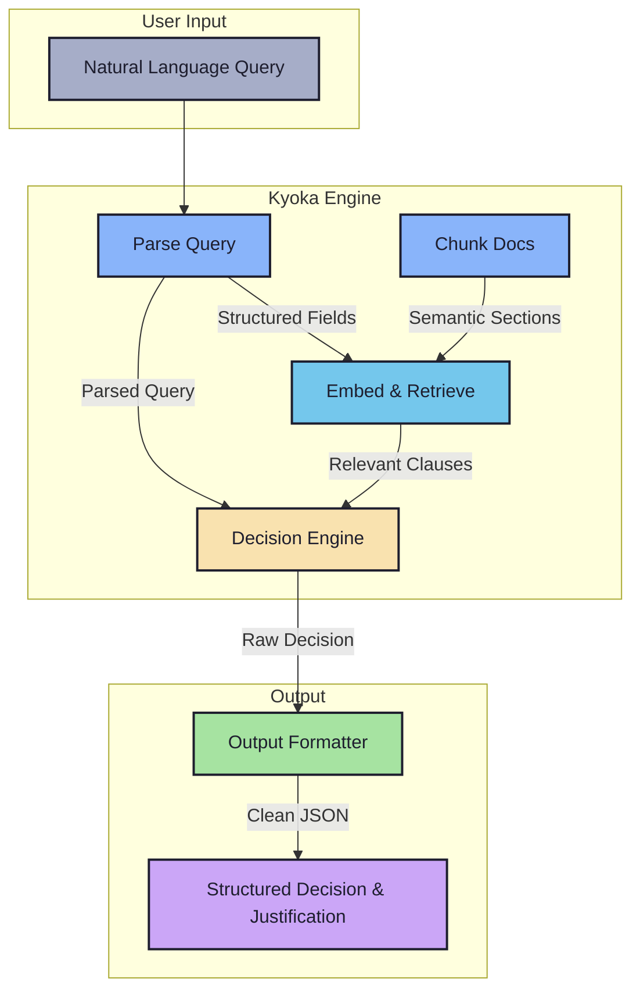
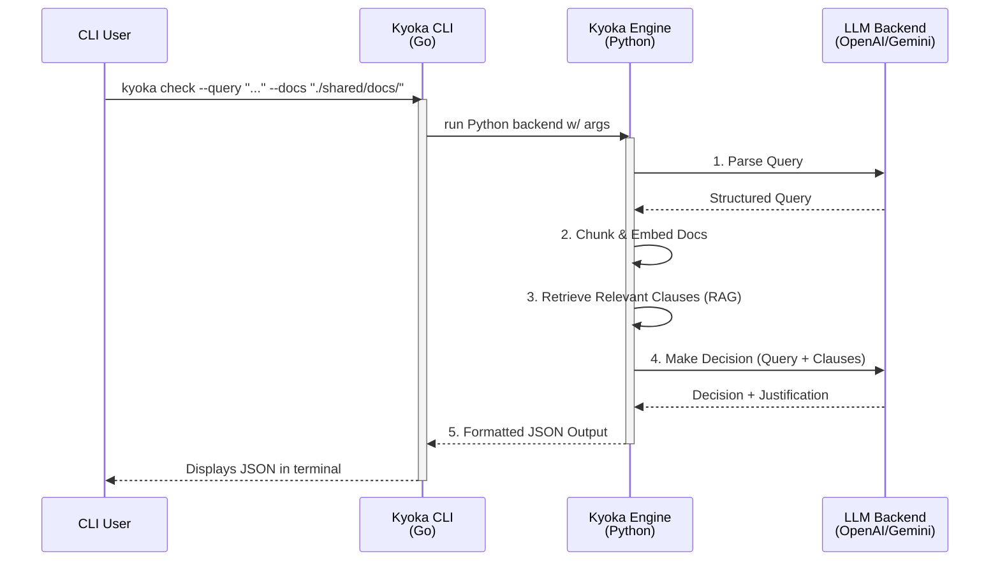

# Kyoka — LLM-Powered Insurance Clause Reasoning Engine

> "Precision, judgment, and clarity — from vague queries to concrete decisions."

---

## Overview

**Kyoka** is a CLI-first system that leverages Large Language Models (LLMs) to interpret natural language queries and retrieve relevant information from complex, unstructured insurance documents (PDFs, DOCX, emails).

It semantically understands queries, searches policy clauses, and makes explainable, structured decisions such as coverage approval or payout eligibility — returning clean, JSON-formatted results.

---

## Use Case

Given a query like:

```txt
"46M, knee surgery in Pune, 3-month-old insurance policy"
````

Kyoka will:

1. Parse and structure the query (age, procedure, location, etc.)
2. Retrieve semantically relevant clauses from provided documents
3. Apply logic and policy rules to return:

   * Decision (e.g. `approved`)
   * Amount (if applicable)
   * Justification (clause-linked reasoning)

---

## Diagrams 

### Architecture



### Workflow 



---

## Features

* **LLM-powered query understanding**
* **Legal-aware document chunking** with section + clause tracking
* **RAG + reasoning** pipeline to answer vague or domain-specific queries
* **Configurable LLM backends** — supports OpenAI & Gemini
* **Explainable outputs** with clause mapping
* **CLI-first design**, TUI optional
* Easy JSON integration for downstream audit or claim processing

---

## Project Structure

```
kyoka/
├── backend/                     ← core logic (Python)
│   ├── parse_query.py
│   ├── chunk_docs.py
│   ├── embed_index.py
│   ├── decision_engine.py
│   └── main.py
│
├── cli/                         ← fast CLI frontend (Go)
│   ├── main.go
│   └── commands/run.go
│
├── shared/                      ← sample queries, outputs, docs
│   ├── docs/
│   ├── outputs/
│   └── test_queries.txt
│
├── .env                         ← api keys and config
├── requirements.txt
└── README.md
```

---

## Configuration

Create a `.env` file with:

```env
LLM_PROVIDER=openai        # or gemini
OPENAI_API_KEY=sk-...
GEMINI_API_KEY=...
```

---

## Usage

### from CLI:

```bash
$ kyoka check \
    --query "46M, knee surgery in Pune, 3-month-old policy" \
    --docs ./shared/docs/
```

### output:

```json
{
  "decision": "approved",
  "amount": "₹50,000",
  "justification": [
    {
      "clause": "Section C.4.2: Orthopedic treatments are covered after 90 days.",
      "reason": "Query specifies 3-month-old policy and knee surgery."
    }
  ]
}
```

---

## Architecture

* **Parse Query** → Extract structured fields from free text using LLMs
* **Chunk Docs** → Convert docs to semantic sections (with clause hierarchy)
* **Embed & Retrieve** → Use vector search for semantic match
* **Decision Engine** → Feed parsed query + retrieved clauses to LLM
* **Output Formatter** → JSON with clause mapping & reasoning

---

## Status

* [x] LLM-based query parser
* [ ] Legal-aware document chunker
* [ ] FAISS embed + retrieval
* [ ] Decision engine w/ explainable output
* [ ] CLI interface in Go
* [ ] Optional TUI

---

## Why We're Different

* Built for **explainability**, not just RAG
* Handles **vague and incomplete** queries
* Traceable clause-based **justification logic**
* CLI-first, audit-ready output
* Modular LLM backend: OpenAI, Gemini, Ollama

---

## Sample Datasets

* `GROUP DOMESTIC TRAVEL INSURANCE`
* `GLOBAL HEALTH CARE`
* Custom uploads supported (PDF, DOCX, emails)

---

## Authors

* alok ranjan [@ryu-ryuk](https://github.com/ryu-ryuk)

---

## License

[MIT](LICENSE)

