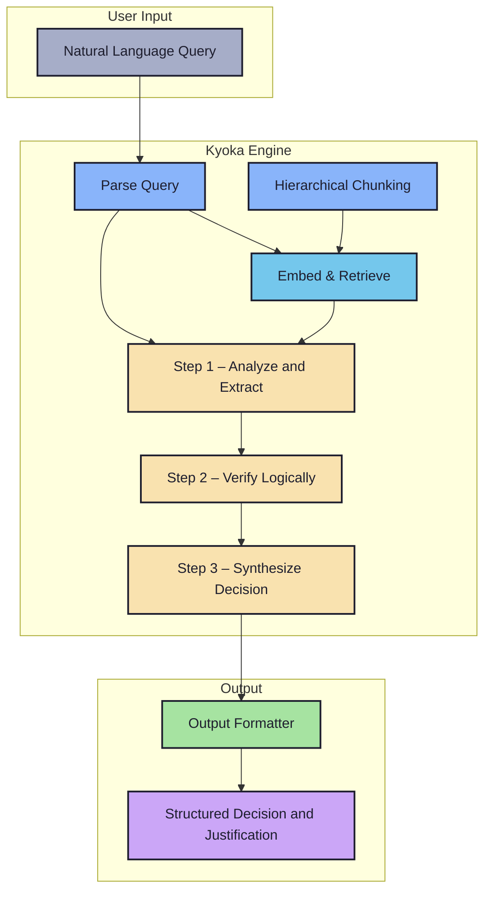
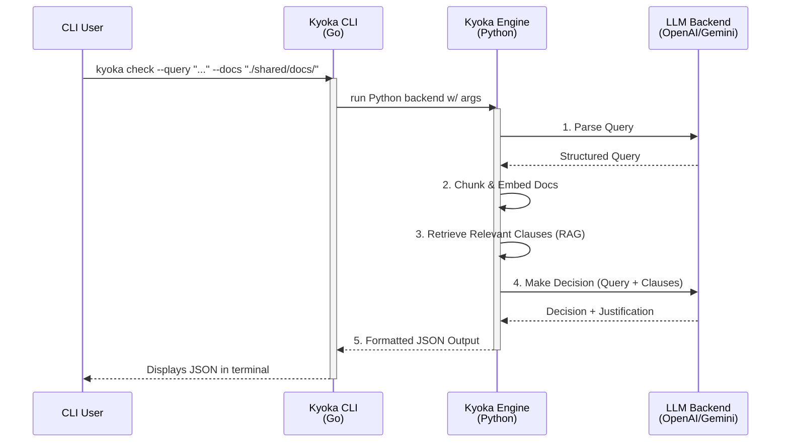

# Kyoka — LLM-Powered Insurance Clause Reasoning Engine

> "Precision, judgment, and clarity — from vague queries to concrete decisions."

---

## Overview

**Kyoka** is a CLI-first system that leverages Large Language Models (LLMs) to interpret natural language queries and retrieve relevant information from complex, unstructured insurance documents (PDFs, DOCX, emails).

It semantically understands queries, searches policy clauses, and makes explainable, structured decisions such as coverage approval or payout eligibility — returning clean, JSON-formatted results.

---

## Use Case

Given a query like:

```txt
"46M, knee surgery in Pune, 3-month-old insurance policy"
````

Kyoka will:

1. Parse and structure the query (age, procedure, location, etc.)
2. Retrieve semantically relevant clauses from provided documents
3. Apply logic and policy rules to return:

   * Decision (e.g. `approved`)
   * Amount (if applicable)
   * Justification (clause-linked reasoning)

---

## Diagrams 

### Architecture



### Workflow 



---

## Features

### kyoka engine — core features

- **multi-step reasoning**  
  a robust `analyze -> verify -> synthesize` pipeline for accurate, explainable decisions.

- **interactive clarification**  
  asks for more information when queries are ambiguous instead of guessing.

- **hierarchical document chunking**  
  parses documents by section, clause, and sub-clause for precise context and citation.

- **policy pre-computation**  
  a one-time init step creates a policy summary to improve accuracy on all subsequent queries.

- **configurable llm backends**  
  supports both **openai** and **gemini** models.

- **explainable outputs**  
  includes precise clause mapping for each decision.

- **cli-first design**  
  tui is optional and modular.


---

## Project Structure

```
kyoka/
├── backend/                     ← core logic (Python)
│   ├── parse_query.py
│   ├── chunk_docs.py
│   ├── embed_index.py
│   ├── decision_engine.py
│   └── main.py
│
├── cli/                         ← fast CLI frontend (Go)
│   ├── main.go
│   └── commands/run.go
│
├── shared/                      ← sample queries, outputs, docs
│   ├── docs/
│   ├── outputs/
│   └── test_queries.txt
│
├── .env                         ← api keys and config
├── requirements.txt
└── README.md
```

---

## Configuration

Create a `.env` file with:

```env
LLM_PROVIDER=openai        # or gemini
OPENAI_API_KEY=sk-...
GEMINI_API_KEY=...
```

---

## Usage

### how kyoka works

#### 1. initialize & pre-compute (one-time)
first, let kyoka analyze and create a high-level summary of your policies.  
this summary is reused in all future queries to improve accuracy.

```bash
$ kyoka init --docs ./shared/docs/
> successfully processed 2 documents. policy summary created.
````

---

#### 2. check a query

run a check with your natural language query.

```bash
$ kyoka check \
    --query "46M, knee surgery in Pune, 3-month-old policy" \
    --docs ./shared/docs/
```

---

#### 3. interactive clarification

if a query is ambiguous, kyoka will ask for the information it needs to make a decision.

```json
{
  "decision": "clarification_needed",
  "message": "Policy has different coverage for in-network vs. out-of-network hospitals. Please specify the hospital type.",
  "options": ["in-network", "out-of-network"]
}
```

---

## Architecture

### kyoka engine — internal pipeline

- **parse query**  
  extract structured fields from free text using llms.

- **hierarchical chunking**  
  convert documents into sections with parent/child clause relationships.

- **embed & retrieve**  
  use vector search for semantic matching against clause chunks.

- **multi-step reasoning engine**  
  a robust pipeline that:
  - analyzes retrieved clauses to extract key parameters (e.g., waiting periods, monetary limits)
  - verifies the query against extracted parameters with rule/code-based logic
  - synthesizes a final decision and justification based on the verification step

- **output formatter**  
  clean json with precise clause mapping and reasoning.

---

## Status

- [ ] llm-based query parser  
- [ ] hierarchical document chunker  
- [ ] faiss embed + retrieval  
- [ ] multi-step reasoning engine with verifier  
- [ ] interactive clarification mode  
- [ ] cli interface in go (`init` and `check` commands)  
- [ ] optional tui  


---

## Why We're Different

- goes beyond rag with a **multi-step verification** process for true decision logic  
- handles vague queries with an **interactive clarification** mode  
- traceable, **hierarchical clause-based justification** logic  
- **cli-first**, audit-ready output for easy system integration  
- **modular llm backend** — supports openai, gemini, and ollama  

---

## Sample Datasets

* `GROUP DOMESTIC TRAVEL INSURANCE`
* `GLOBAL HEALTH CARE`
* Custom uploads supported (PDF, DOCX, emails)

---

## Authors

* alok ranjan [@ryu-ryuk](https://github.com/ryu-ryuk)

---

## License

[MIT](LICENSE)

